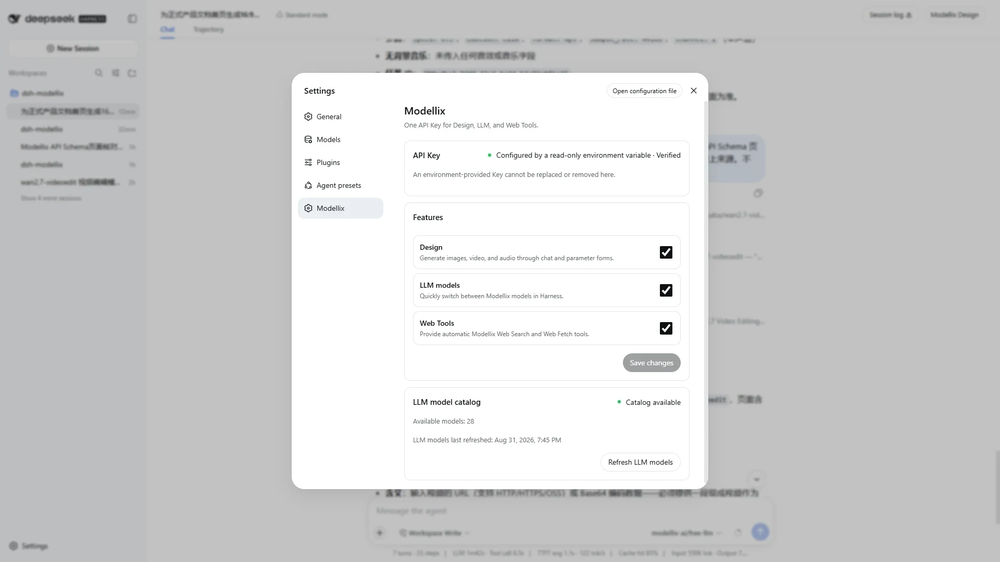
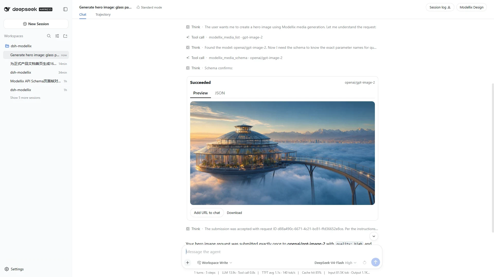
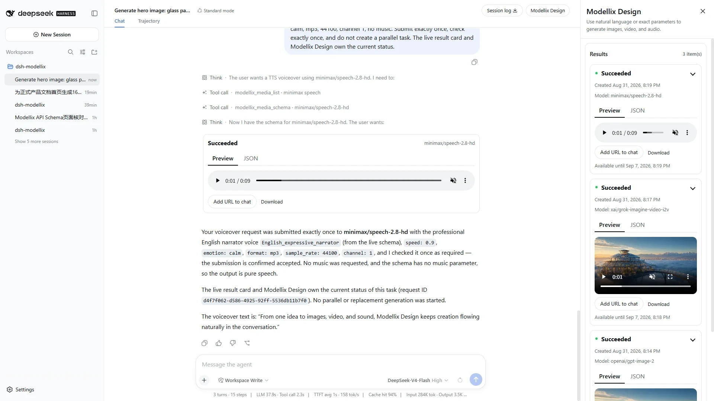
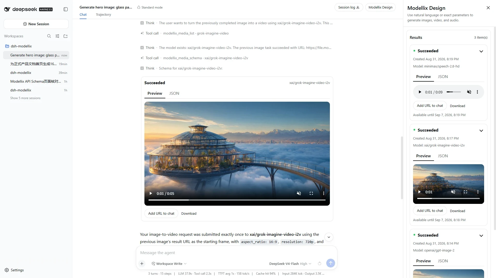
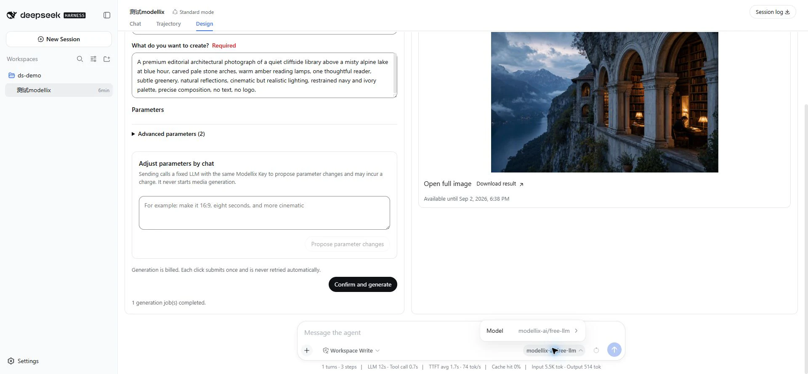
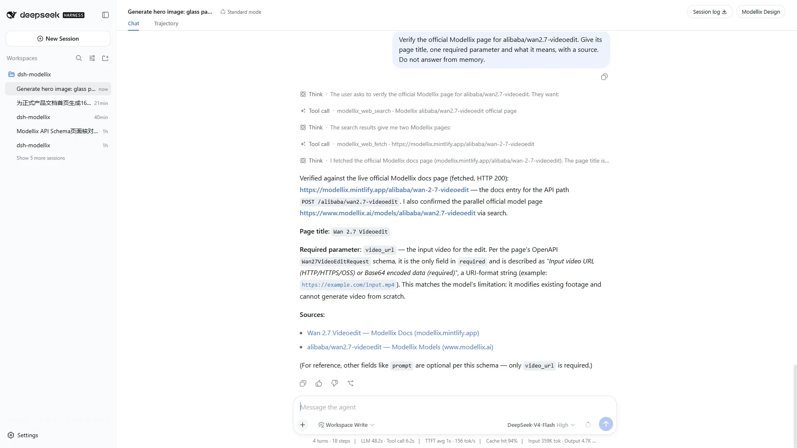

[English](USER_GUIDE.md) | [简体中文](../zh-CN/USER_GUIDE.md)

# dsh-modellix User Guide

This guide describes the current `0.2.0` experience. Media creation is chat-first; there is no standalone Design tab. The right-side **Modellix Design** panel is a session-scoped result workspace.

## 1. Install and verify

### Requirements

- DeepSeek Harness `0.1.1-rc.2`
- Node.js `^22.19.0 || >=24.0.0`
- A valid Modellix API Key

Install the package into the Harness Web profile:

```sh
dsh plugin --profile web add dsh-modellix
dsh --profile web --dump-config
dsh --profile web
```

The dumped configuration should contain the `dsh-modellix` Bundle and plugin id `modellix`. Restart the running profile after installing or updating a Client bundle.

To use a local package artifact:

```sh
pnpm install --frozen-lockfile
pnpm run verify:release:static
pnpm pack
dsh plugin --profile web add ./dsh-modellix-0.2.0.tgz
```

See [LOCAL_USAGE.md](LOCAL_USAGE.md) for isolated-profile setup and update commands.

## 2. Connect Modellix

### First-time flow

1. Open the Harness Web UI.
2. In **Connect Modellix**, enter a valid API Key.
3. Keep Design, LLM, and Web enabled unless your environment intentionally disables one capability.
4. Select **Save and enable**.
5. Open Settings → Modellix and verify that the Credential source/status and LLM catalog are healthy.

The stored Key is write-only. After save, the UI displays status and source but never returns the Key to the Client.

Select **Configure later** only when you want to postpone setup. The plugin remains unavailable and asks again on the next explicit use of an enabled Modellix capability.

### Environment Credential

You can supply `MODELLIX_API_KEY` in the Harness launch environment. The settings UI reports an environment source but cannot display, replace, or remove it. Update the external secret and restart Harness.

### Secret handling

Never place a real Key in:

- a repository, patch, fixture, document, or screenshot;
- a command argument, URL, query, hash, or browser storage;
- Client state, DOM/ARIA, logs, Console, toast, telemetry, HAR, recording, or snapshot.

## 3. Understand the current interface



The plugin adds:

- a Modellix section in Settings;
- a **Modellix Design** launcher at the far right of the session header;
- chat result cards for media generation/result tools;
- Modellix models in the Harness model selector;
- explicit Modellix Web tools available to the Agent.

It does not add a standalone Design tab.

### Right-side panel

- Desktop width is fixed at 360 px so its internal card layout does not compress during the open/close transition.
- At 560 px and below it becomes a full-width panel.
- Results and every card are expanded by default.
- Select **Results** to collapse the whole list; select a card header to collapse only that card.
- Select X to close. Keyboard focus returns to the launcher.
- The advanced exact-parameter editor remains in the implementation but its entry is hidden for `0.2.0`.

## 4. Create media by chatting

Ordinary users should describe the desired work in natural language. The Agent selects tools and models according to the conversation.

### New text-to-image request

Example:

> Create a polished 16:9 architectural hero image: a glass botanical research pavilion floating above a dawn cloud sea, connected to an observation bridge, restrained lapis-blue and warm-gold tones, realistic premium materials, no people, no text, no logo, no watermark.

If the user names a model or exact fields, the Agent still checks the live Schema before submission.

### Continue from the previous work

Example:

> Turn the image just completed in this conversation into a five-second cinematic video. Slowly push the camera forward and preserve the composition and palette.

The Agent treats references to the previous/current work, a conversation attachment, or a prior Modellix URL as source-dependent. It should select an edit or transformation model and place the latest relevant URL into that model's declared media input field. It must not silently replace the request with a new text-to-image or text-to-video task.

### Use a local file or attachment

When the live Schema needs an HTTP(S) media URL, the Agent can call `modellix_media_upload_file` for:

- a current-session attachment; or
- a regular, non-symlink file inside the session workspace.

An upload is not automatically replayed if the outcome is unknown.

### Generate voice

Example:

> Generate this English voiceover with a professional narrator, calm emotion, MP3 at 44.1 kHz: “From one idea to images, video, and sound, Modellix Design keeps creation flowing naturally in the conversation.”

The Agent must use a Schema-published voice and parameter format instead of translating or guessing enum values.

## 5. Media tools and routing

| Tool | Purpose | Important behavior |
| --- | --- | --- |
| `modellix_media_list` | Search the live image/video/audio model catalog | Read-only; use when no compatible model is already known |
| `modellix_media_schema` | Read the live API Schema for a model slug | Returns field paths, required state, options, and an IR contract hash |
| `modellix_media_prepare` | Convert a natural-language adjustment into a reviewable Schema patch | Does not generate media; requires confirmation before applying |
| `modellix_media_upload_file` | Upload a valid attachment/workspace file and return a URL | One-shot; unknown outcome is not replayed |
| `modellix_media_generate` | Submit one Schema-validated generation | Submission is not automatically retried |
| `modellix_media_get_result` | Read the current task result | Agent checks at most once in the submit turn; Client watcher owns continued status |

The Agent routing context is injected only while Design is enabled. Disabling Design removes these tools from model visibility.

## 6. Result cards and status



### Running

The chat card shows only its header/status and model. Preview and JSON are hidden because no successful resource exists yet. The assistant's ordinary response says the submission was accepted and points to the live card/panel; it does not embed a stale “running” state.

### Succeeded

The existing card updates in place and exposes:

- **Preview** and **JSON** tabs;
- image enlargement, video playback, or audio playback;
- **Add URL to chat**;
- **Download**.

The corresponding one-shot result query is suppressed when the generation card already owns the same job. This prevents two identical cards.

### Failed

The card remains concise and shows the failure state/diagnostic. Preview and JSON are not presented as if a successful resource existed.

### Session ownership

Every new task records the Harness session id. Chat cards and the drawer read the same session controller, so:

- the left/chat status and right/drawer status converge to the same task snapshot;
- a task created in another conversation is not shown;
- reopening/remounting the layout does not destroy the background watcher;
- legacy records without a session id remain readable for compatibility but are not injected into a new conversation.

### Expiry and storage

The plugin stores replay identifiers, task state, resource URLs, and timestamps. It does not store prompts, API Keys, or media copies in the task WAL. If the upstream result has no expiry, the UI applies a seven-day local display limit.

## 7. Use the Modellix Design panel



1. Select **Modellix Design** in the conversation header.
2. Confirm that the result count matches the current session.
3. Collapse or expand the Results section.
4. Collapse or expand a card from its header.
5. Switch between Preview and JSON for a successful card.
6. Select **Add URL to chat** to continue editing or transforming that resource.
7. Select **Download** to open the upstream file.
8. Select X to close the panel.

## 8. Preview media



### Images

Select the image to open an enlarged dialog. Focus enters the dialog, Tab stays inside, Escape closes it, and focus returns to the image trigger.

### Video

The native player supports playback, seek, volume/mute, fullscreen, and the browser's media menu. A completed result should load metadata and advance current time after Play.

### Audio

The native audio player supports playback, seek, volume/mute, and the browser's media menu. A completed result should load duration and advance current time after Play.

## 9. Use Modellix LLM models



1. Keep LLM enabled in Modellix settings.
2. Check catalog status/count or select **Refresh** if needed.
3. Open the Harness model selector.
4. Choose a model in the Modellix group.
5. Send the next Agent turn.

The provider endpoint is OpenAI-compatible. Provider retries are `0`; unavailable catalog data does not produce fake model entries.

## 10. Automatic Web Search and Fetch



Ask the question normally. For example:

> Verify the official Modellix page for alibaba/wan2.7-videoedit. Give its title, one required parameter and what it means, with a source. Do not answer from memory.

Expected flow:

1. Agent automatically calls `modellix_web_search`.
2. When full-page content is needed, Agent calls `modellix_web_fetch`.
3. The answer cites the fetched/source pages.

The user should not need to say “use search” or “use fetch.” If the user explicitly says not to browse, the Agent does not call them. The routing context also prevents duplicate calls to both the explicit tools and native provider tools for the same operation.

## 11. Settings and errors

### Feature switches

- **Design:** controls media tools, chat result views, and the result panel.
- **LLM:** controls live Modellix model materialization.
- **Web:** controls Modellix Search/Fetch providers and explicit tools.

### Credential status

Only HTTP 401 is an invalid Credential. Other cases remain distinct:

| State | Meaning / next step |
| --- | --- |
| 402 | Check account status in Modellix |
| 429 | Wait for the rate limit window |
| Offline/timeout | Restore connectivity; do not assume the Key is invalid |
| 5xx | Service error; retry only when the operation is safe |
| Unknown generation/upload result | Inspect the task/transcript/Modellix record before any manual repeat |

Concurrent 401 responses open only one Credential dialog. Settings always retains a replace-Key action where the Credential is writable.

Routine UI operations do not show a payment warning. Users with a required Modellix Key can review consumption and details in Modellix.

## 12. Accessibility and responsive checks

- Dialogs have visible titles, dialog semantics, initial focus, focus trap, background inertness, and focus restoration.
- The required Credential gate cannot disappear through Escape/backdrop/X; **Configure later** is always keyboard reachable.
- Inputs use real labels and linked help/error text.
- Busy and invalid states are exposed through ARIA.
- Result tabs support Arrow/Home/End behavior.
- Pointer targets are at least 24×24 CSS px and expand to 48×48 for coarse pointers.
- Light, dark, forced-colors, reduced-motion, 320/560/768/1440 widths, and 200% text scaling are supported.

## 13. Troubleshooting

### Modellix Design is missing

Confirm Design is enabled, inspect `dsh --profile web --dump-config`, and fully restart the profile after a plugin update.

### The Agent does not use Web automatically

Confirm Web is enabled and the current Agent session contains the `Web routing` context. The explicit tools should appear as `modellix_web_search` and `modellix_web_fetch`.

### A model Schema is reported as unavailable

Refresh the live media catalog, verify the exact model slug returned by `modellix_media_list`, and read `modellix_media_schema` again. The parser supports documented OpenAPI layouts and bounded shared references; it blocks unsafe or unsupported contracts instead of guessing.

### A task never updates

Keep the conversation open long enough for the Client watcher, verify the Credential epoch has not changed, and inspect the right panel. Do not submit a replacement merely because an immutable assistant sentence looks old; current status belongs to the card/panel.

### Two cards represent one task

This is not expected in `0.2.0`. Capture the two job ids and tool call ids without Secrets. The generation card should win the per-session task claim, and the matching result-query card should be suppressed.

### Results from another conversation appear

This is not expected for new `0.2.0` tasks. Record the affected session/task ids and report it as a session-isolation defect.

### Media cannot play

Confirm the result is Succeeded, the upstream URL has not expired, and the browser can reach the file origin. Failed or running tasks intentionally have no player.

## 14. Screenshot catalog

All twelve official captures are 1920×1080 and come from real English or Chinese UI sessions:

| English screenshot | What it proves |
| --- | --- |
| `settings-ready-en.webp` | Write-only Credential status, enabled services, live catalog |
| `chat-media-generation-en.webp` | One completed image card in chat |
| `design-results-drawer-en.webp` | Session-scoped image/video/audio result list |
| `media-players-en.webp` | Real video/audio preview controls |
| `llm-model-selector-en.webp` | Live Modellix models in Harness |
| `web-tools-auto-en.webp` | Automatic explicit Search and Fetch |

No screenshot contains a real Key, Network request, HAR, Console output, Credential file, cookie, or browser storage.

## 15. Acceptance and release

Use [RELEASE_CHECKLIST.md](RELEASE_CHECKLIST.md) for the step-by-step manual acceptance and evidence requirements. The Chinese equivalent is [../zh-CN/RELEASE_CHECKLIST.md](../zh-CN/RELEASE_CHECKLIST.md).

## 16. Uninstall

Remove a writable local Key in Modellix settings, or revoke an environment Key externally. Then:

```sh
dsh plugin --profile web remove dsh-modellix
dsh --profile web --dump-config
dsh --profile web
```

Uninstallation does not delete upstream tasks, external environment variables, or every Harness profile artifact.

## References

- [README](../../README.md)
- [Modellix getting started](https://docs.modellix.ai/get-started)
- [Modellix model catalog](https://www.modellix.ai/models)
- [DeepSeek Harness](https://github.com/deepseek-ai/deepseek-harness)
