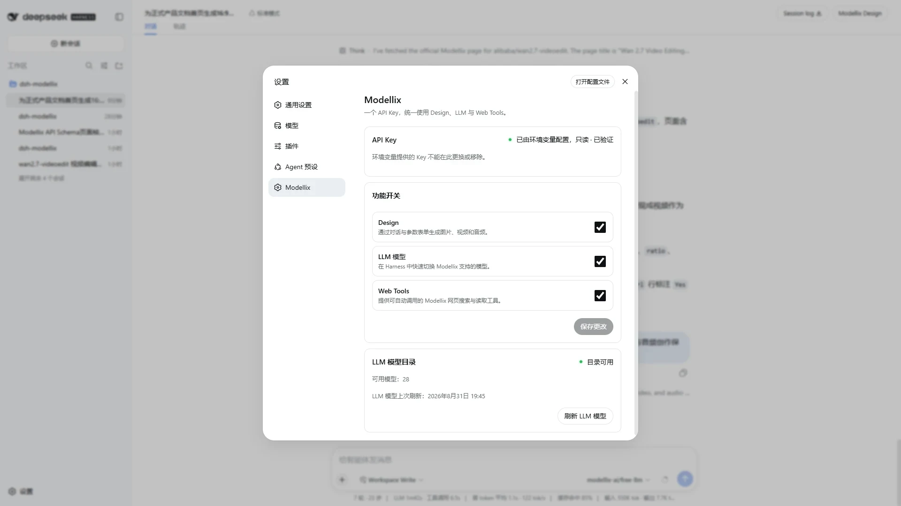
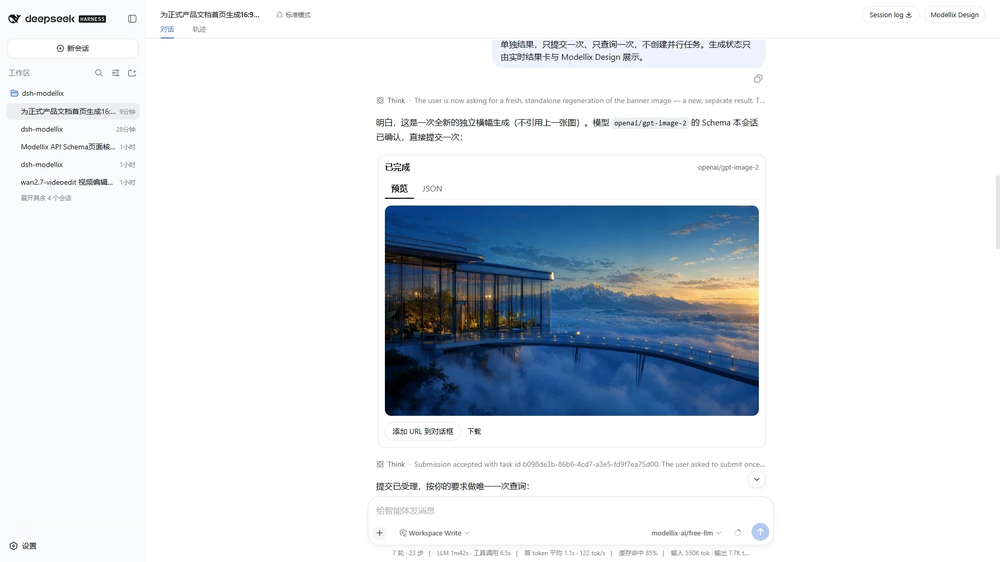
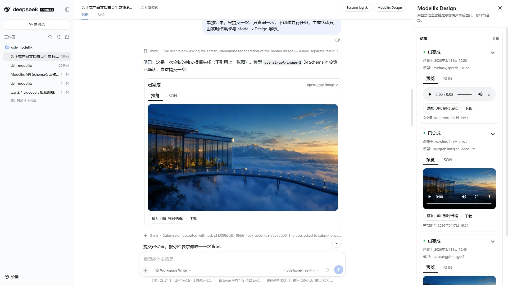
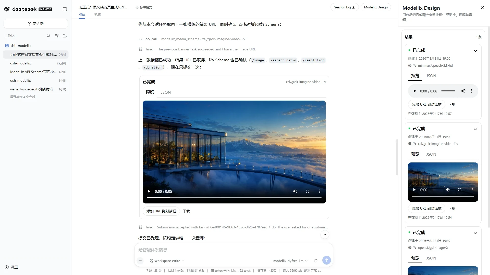
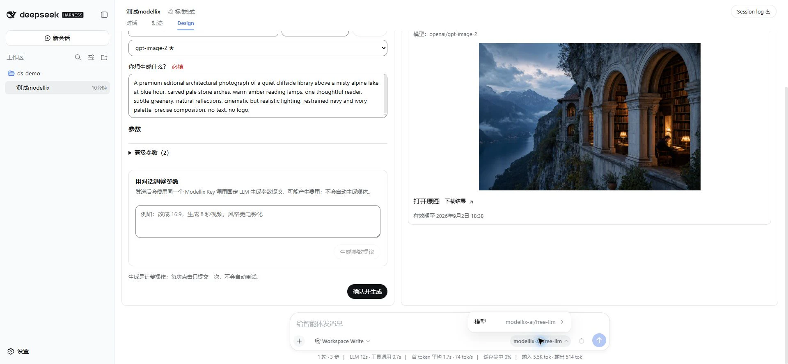
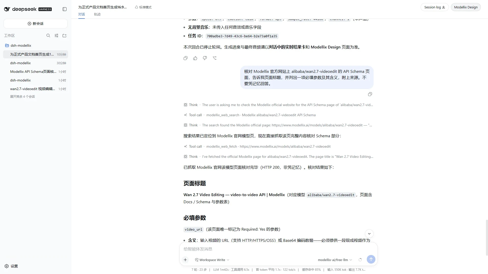

[English](../en-US/USER_GUIDE.md) | [简体中文](USER_GUIDE.md)

# dsh-modellix 用户指南

本文说明 `0.2.1` 的当前体验。媒体创作以对话为主，不再存在独立 Design Tab；右侧 **Modellix Design** 是按会话隔离的结果工作区。

## 1. 安装与检查

### 环境要求

- DeepSeek Harness `0.1.2-alpha.4`（最新支持版本）；继续兼容 `0.1.1-rc.2`
- Node.js `^22.19.0 || >=24.0.0`
- 有效的 Modellix API Key

把包安装到 Harness Web profile：

```sh
dsh plugin --profile web add dsh-modellix
dsh --profile web --dump-config
dsh --profile web
```

配置输出应包含 `dsh-modellix` Bundle 和 id 为 `modellix` 的插件。安装或更新 Client bundle 后，需要重启正在运行的 profile。

安装本地构建产物：

```sh
pnpm install --frozen-lockfile
pnpm run verify:release:static
pnpm pack
dsh plugin --profile web add ./dsh-modellix-0.2.1.tgz
```

独立 Profile 与更新命令见 [LOCAL_USAGE.md](LOCAL_USAGE.md)。

## 2. 连接 Modellix

### 首次配置

1. 打开 Harness Web UI。
2. 在 **连接 Modellix** 中输入有效 API Key。
3. 除非环境明确禁用某项能力，否则保留 Design、LLM、Web 开启。
4. 选择 **保存并启用**。
5. 打开设置 → Modellix，确认 Credential 来源/状态与 LLM 目录健康。

已存 Key 是 write-only。保存后 UI 只显示状态和来源，不会把 Key 返回给 Client。

只有需要推迟配置时才选择 **稍后配置**。插件不会变为可用，并会在下一次显式使用已开启的 Modellix 能力时再次请求配置。

### 环境 Credential

可以在 Harness 启动环境中提供 `MODELLIX_API_KEY`。设置页会显示环境来源，但不能查看、更换或移除。应更新外部 Secret 后重启 Harness。

### Secret 边界

真实 Key 不得进入：

- 仓库、补丁、fixture、文档或截图；
- 命令参数、URL、query、hash 或浏览器存储；
- Client 状态、DOM/ARIA、日志、Console、Toast、遥测、HAR、录像或快照。

## 3. 认识当前界面



插件会新增：

- 设置页中的 Modellix 区域；
- 会话头部最右侧的 **Modellix Design** 入口；
- 媒体生成/结果工具的对话卡片；
- Harness 模型选择器中的 Modellix 模型；
- Agent 可见的明确 Modellix Web 工具。

插件不会新增独立 Design Tab。

### 右侧面板

- 桌面内部宽度固定为 360px，开合过程中卡片布局不会被压缩。
- 560px 及以下变为全宽面板。
- 结果列表和每张卡片默认展开。
- 点击 **结果** 收起整个列表；点击卡片头部只收起该卡片。
- 点击 X 关闭，键盘焦点回到入口。
- 高级精准参数编辑器保留在实现中，但 `0.2.1` 隐藏入口。

## 4. 通过对话创建媒体

普通用户直接用自然语言描述作品，Agent 根据会话选择工具与模型。

### 新建文生图

示例：

> 创建一张精致的 16:9 建筑首页图：玻璃植物研究馆漂浮在晨曦云海上，以观景桥连接，青金蓝与暖金配色，真实高级材质，无人物、无文字、无 Logo、无水印。

即使用户指定模型或精确字段，Agent 仍会在提交前读取实时 Schema。

### 继续处理上一项作品

示例：

> 把当前会话刚完成的图片做成 5 秒电影感视频。镜头缓慢前推，保持原构图和配色。

Agent 会把“上一项/当前作品”、会话附件或旧 Modellix URL 视为依赖源文件的操作，选择编辑或转换模型，并将最新相关 URL 填入该模型声明的媒体输入字段；不会静默替换为新的文生图或文生视频。

### 使用本地文件或附件

当实时 Schema 需要 HTTP(S) 媒体 URL 时，Agent 可以通过 `modellix_media_upload_file` 上传：

- 当前会话附件；或
- 会话工作区内的普通非符号链接文件。

上传结果未知时不会自动重复。

### 生成语音

示例：

> 为这段英文生成专业旁白，情绪平静，MP3、44.1 kHz：“From one idea to images, video, and sound, Modellix Design keeps creation flowing naturally in the conversation.”

Agent 必须使用 Schema 公布的音色和参数格式，不翻译或猜测枚举值。

## 5. 媒体工具与路由

| 工具 | 用途 | 关键行为 |
| --- | --- | --- |
| `modellix_media_list` | 查询实时图片/视频/音频模型目录 | 只读；尚不知道兼容模型时使用 |
| `modellix_media_schema` | 读取指定模型 slug 的实时 API Schema | 返回字段路径、必填状态、选项和 IR contract hash |
| `modellix_media_prepare` | 将自然语言调整转换为可审查的 Schema patch | 不生成媒体；应用前需要确认 |
| `modellix_media_upload_file` | 上传有效附件/工作区文件并返回 URL | 一次性；未知结果不重放 |
| `modellix_media_generate` | 提交一次通过 Schema 校验的生成 | 不自动重试提交 |
| `modellix_media_get_result` | 查询当前任务结果 | 提交回合最多查询一次；后续状态由 Client 监听器负责 |

只有 Design 开启时才注入媒体路由上下文并注册这些工具。关闭 Design 后，模型不再看到它们。

## 6. 结果卡片与状态



### 生成中

对话卡片只显示头部/状态和模型。没有成功资源时隐藏 Preview/JSON。助手正文只说明提交已接受并引导查看实时卡片/面板，不写入会过期的“生成中”状态。

### 已完成

原卡片就地更新并提供：

- **预览** 与 **JSON** Tab；
- 图片放大、视频播放或音频播放；
- **添加 URL 到对话框**；
- **下载**。

当生成卡已持有同一任务时，对应的一次结果查询卡会被抑制，避免重复两条。

### 失败

卡片保持简洁，显示失败状态/诊断。没有成功资源时不会伪装为可预览结果。

### 会话归属

每个新任务都记录 Harness session id。对话卡和抽屉共享同一会话 Controller，因此：

- 左侧对话状态与右侧抽屉状态会收敛到同一快照；
- 其他会话创建的任务不会显示；
- 布局重新挂载不会销毁后台监听器；
- 没有 session id 的旧记录可以兼容读取，但不会注入新会话。

### 有效期与存储

插件在任务 WAL 中保存重放标识、任务状态、资源 URL 与时间戳，不保存提示词、API Key 或媒体副本。上游没有返回有效期时，UI 应用七天本地展示期限。

## 7. 使用 Modellix Design 面板



1. 点击会话头部 **Modellix Design**。
2. 确认结果数量与当前会话一致。
3. 收起或展开“结果”区域。
4. 点击卡片头部收起或展开单卡。
5. 成功卡可切换预览与 JSON。
6. 选择 **添加 URL 到对话框**，继续编辑或转换该资源。
7. 选择 **下载** 打开上游文件。
8. 点击 X 关闭面板。

## 8. 预览媒体



### 图片

点击图片打开大图 Dialog。焦点进入弹窗，Tab 保持在弹窗内，Escape 关闭，焦点回到图片入口。

### 视频

原生播放器支持播放、进度、音量/静音、全屏与浏览器媒体菜单。成功结果应能加载 metadata，点击播放后 currentTime 会推进。

### 音频

原生播放器支持播放、进度、音量/静音与浏览器媒体菜单。成功结果应能读取时长，点击播放后 currentTime 会推进。

## 9. 使用 Modellix LLM



1. 在 Modellix 设置中保持 LLM 开启。
2. 检查目录状态/数量，必要时点击刷新。
3. 打开 Harness 模型选择器。
4. 在 Modellix 分组选择模型。
5. 发送下一个 Agent 回合。

Provider 使用 OpenAI 兼容接口，重试次数为 `0`；目录不可用时不会生成假模型。

## 10. 自动 Web Search 与 Fetch



直接提问，例如：

> 核对 Modellix 官方网站上 alibaba/wan2.7-videoedit 的 API Schema 页面，告诉我页面标题，并列出一项必填参数及其含义，附上来源。不要凭记忆回答。

预期流程：

1. Agent 自动调用 `modellix_web_search`。
2. 需要页面全文时自动调用 `modellix_web_fetch`。
3. 回答引用搜索/抓取来源。

用户不需要说“使用 search/fetch”。若用户明确说不要浏览，Agent 不调用。Modellix Web 开启时，路由上下文会避免同一操作同时调用两套工具；关闭时会移除两个明确工具及该路由上下文，当前 Profile 的原生 `web_search` / `web_fetch` 与 Provider 保持可用，Agent 可自动回退。

## 11. 设置与错误

### 功能开关

- **Design：** 控制媒体工具、对话结果卡和结果面板。
- **LLM：** 控制 Modellix 实时模型物化。
- **Web：** 只控制明确的 Modellix Search/Fetch 工具及 Modellix 优先路由，不改变 Harness 原生 Web 工具或 Provider。

三个开关彼此独立。保存一个服务的变化，不会注册、注销或重配另外两个服务。

### Credential 状态

只有 HTTP 401 代表 Credential 无效。其他情况分别处理：

| 状态 | 含义 / 下一步 |
| --- | --- |
| 402 | 在 Modellix 检查账户状态 |
| 429 | 等待限流窗口 |
| 离线/超时 | 恢复网络，不要误判 Key |
| 5xx | 服务错误；仅在操作安全时重试 |
| 生成/上传结果未知 | 重复前检查任务、会话记录或 Modellix 侧记录 |

并发 401 只打开一个 Credential 弹窗。Credential 可写时，设置页始终保留更换 Key 的入口。

常规 UI 操作不显示付费提醒。已配置 Modellix Key 的用户可在 Modellix 查看消耗与明细。

## 12. 可访问性与响应式检查

- Dialog 具有可见标题、语义、初始焦点、焦点陷阱、背景 inert 和焦点恢复。
- 强制 Credential 门禁不能通过 Escape、遮罩或 X 隐式关闭，但 **稍后配置** 始终可达。
- 输入控件使用真实 label 和关联帮助/错误。
- Busy 与 invalid 状态通过 ARIA 暴露。
- 结果 Tab 支持方向键/Home/End。
- pointer target 至少 24×24 CSS px，粗指针扩展到 48×48。
- 支持浅色、深色、forced-colors、reduced-motion、320/560/768/1440 宽度和 200% 文本缩放。

## 13. 排障

### 没有 Modellix Design

确认 Design 已开启，检查 `dsh --profile web --dump-config`，并在插件更新后完全重启 profile。

### Agent 没有自动使用 Web

确认 Web 已开启，并检查当前 Agent 会话包含 `Web routing` 上下文。明确工具应显示为 `modellix_web_search` 与 `modellix_web_fetch`。

若 Web 是有意关闭，两个明确工具与 Modellix `Web routing` 都不应出现；原生 `web_search` / `web_fetch` 按当前 Harness Profile 的配置继续工作。

### 提示模型 Schema 不可用

刷新实时媒体目录，确认 `modellix_media_list` 返回的准确 slug，再调用 `modellix_media_schema`。解析器支持公开 OpenAPI 布局和受限共享引用；遇到不安全或不支持的结构时会阻止使用，而不是猜测。

### 任务一直不更新

保持会话打开让 Client 监听器工作，确认 Credential epoch 未变化，并查看右侧面板。不要因为不可变助手正文看起来旧就重新提交；当前状态属于卡片/面板。

### 同一任务出现两张卡

`0.2.1` 不应出现。请在不包含 Secret 的情况下记录两张卡的 job id 和 tool call id。生成卡应赢得当前会话的任务展示权，匹配的结果查询卡应被抑制。

### 显示其他会话结果

新建 `0.2.1` 任务不应出现。请记录受影响的 session/task id，并按会话隔离缺陷报告。

### 媒体不能播放

确认任务已完成、上游 URL 未过期、浏览器能访问文件域名。失败和生成中任务本来就没有播放器。

## 14. 截图目录

官方 12 张截图均为 1920×1080，分别来自真实英文或中文 UI 会话：

| 中文截图 | 证明内容 |
| --- | --- |
| `settings-ready-zh.webp` | write-only Credential 状态、服务开关、实时目录 |
| `chat-media-generation-zh.webp` | 对话内唯一一张已完成图片卡 |
| `design-results-drawer-zh.webp` | 会话隔离的图片/视频/音频列表 |
| `media-players-zh.webp` | 真实视频/音频预览控件 |
| `llm-model-selector-zh.webp` | Harness 中的 Modellix 实时模型 |
| `web-tools-auto-zh.webp` | 自动明确 Search 与 Fetch |

所有截图均不包含真实 Key、Network 请求、HAR、Console 输出、Credential 文件、Cookie 或浏览器存储。

## 15. 验收与发布

按 [RELEASE_CHECKLIST.md](RELEASE_CHECKLIST.md) 逐步人工验收和生成 Evidence；英文版见 [../en-US/RELEASE_CHECKLIST.md](../en-US/RELEASE_CHECKLIST.md)。

## 16. 卸载

先在 Modellix 设置页移除本地可写 Key，或在外部撤销环境 Key，然后执行：

```sh
dsh plugin --profile web remove dsh-modellix
dsh --profile web --dump-config
dsh --profile web
```

卸载不会删除上游任务、外部环境变量或所有 Harness profile 产物。

## 参考资料

- [中文 README](../../README.zh-CN.md)
- [Modellix 快速开始](https://docs.modellix.ai/get-started)
- [Modellix 模型目录](https://www.modellix.ai/models)
- [DeepSeek Harness](https://github.com/deepseek-ai/deepseek-harness)
