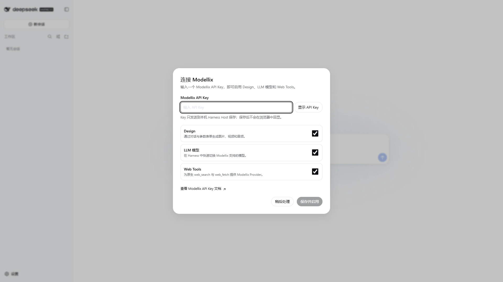
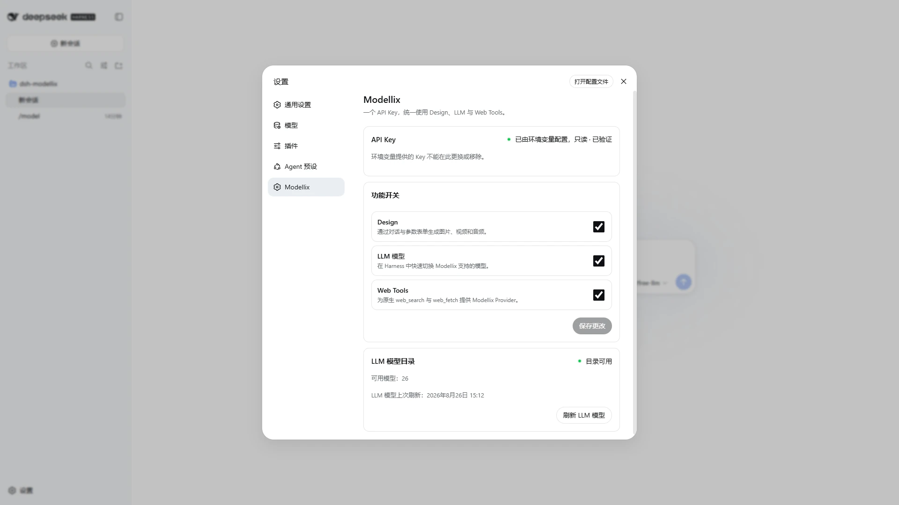
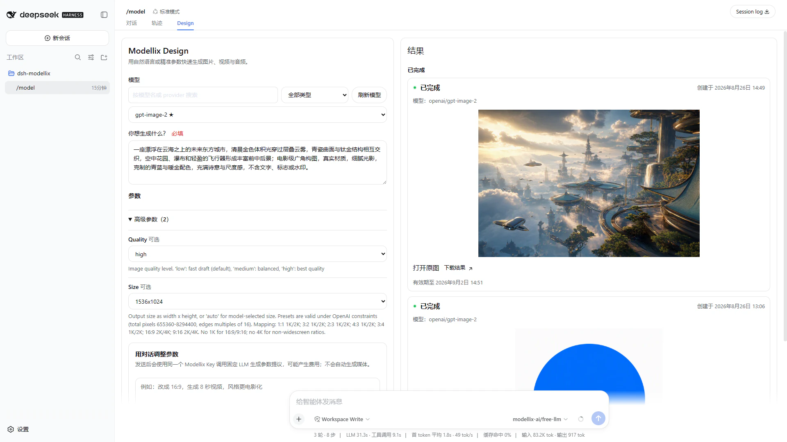
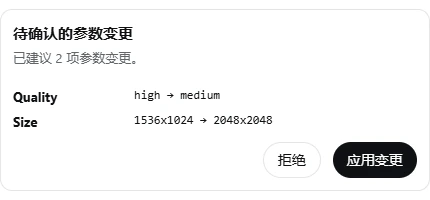
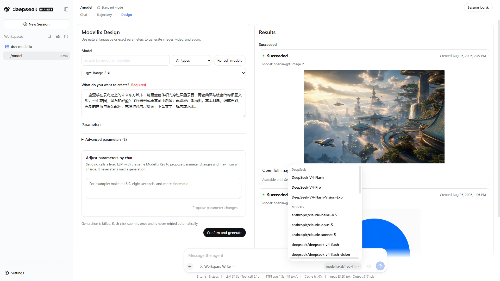
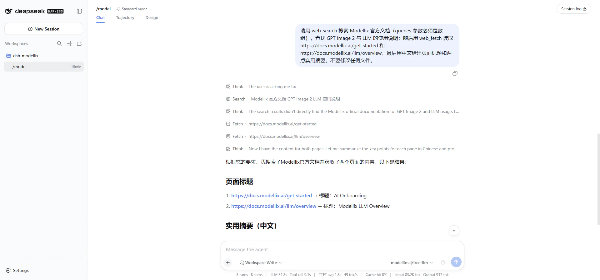
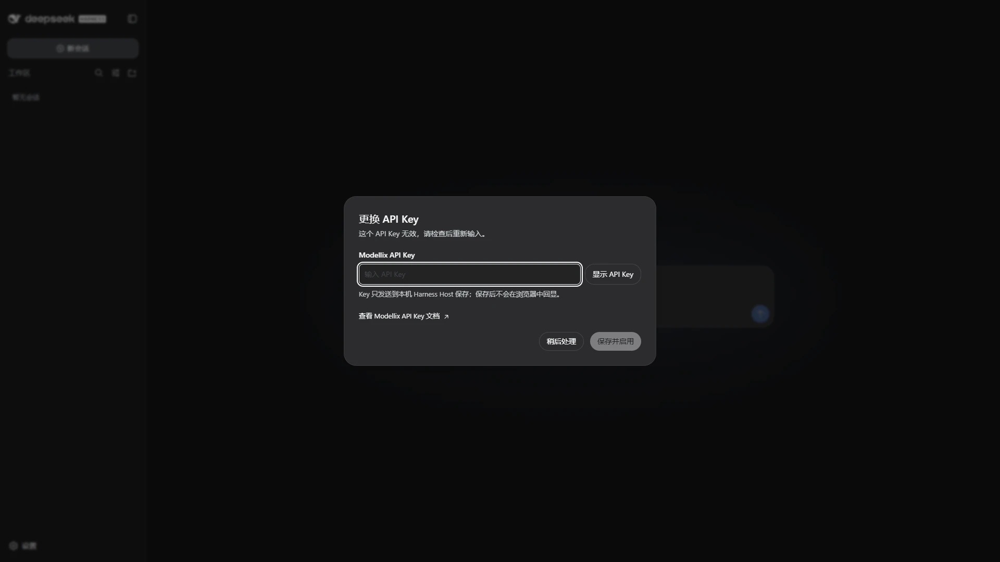
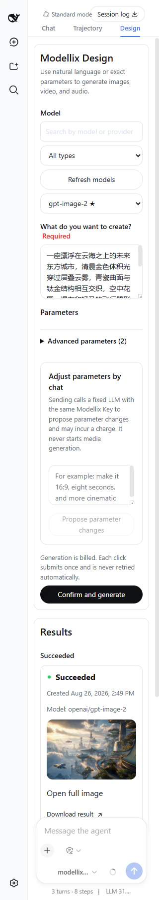

[English](../en-US/USER_GUIDE.md) | [简体中文](USER_GUIDE.md)

# dsh-modellix 用户指南

本指南面向安装和使用 `dsh-modellix` 的 Harness 用户。`README.md` 是默认英文入口，仓库同时提供完整中文版；插件 UI 文案跟随 Harness 当前语言设置。

`dsh-modellix` 用一个 Modellix API Key 提供三项可独立控制的能力：

| 能力 | 入口 | 用途 |
| --- | --- | --- |
| Design | Harness 的 Design 视图 | 选择图片、视频或音频模型，通过提示词、参数表单或自然语言改参，然后查看结果 |
| LLM | Harness 模型选择器与 Modellix 设置页 | 同步 Modellix 实时模型目录并快速切换模型 |
| Web | Harness 原生 Web Tools | 让 `web_search` 和 `web_fetch` 使用 Modellix Provider |

## 安装与验证

### 环境要求

- DeepSeek Harness `0.1.1-rc.2`
- 已发布包运行时：Node.js `^22.19.0 || >=24.0.0`
- 源码开发与发布校验：Node.js `24.18.1`、pnpm `11.24.0`（以 `.nvmrc` 与 `packageManager` 为准）
- 一个有效的 [Modellix API Key](https://docs.modellix.ai/get-started)

本 Bundle 自带 Harness 集成，不把 `modellix-cli` 作为运行依赖，也不会在运行时安装或调用它。

Harness 与本插件当前都使用预发布接口。升级 Harness 前，请检查插件版本、peer dependencies 和仓库中的变更记录。

### 安装已发布包

以下示例使用 `web` profile；如实际 profile 名称不同，请统一替换：

```sh
dsh plugin --profile web add dsh-modellix
dsh --profile web --dump-config
dsh --profile web
```

检查 `--dump-config` 输出，应看到：

- `dsh-modellix` 的 Bundle 配置层；
- id 为 `modellix` 的插件行；
- Web 配置选择 `modellix` Search/Fetch Provider，并启用 Harness 原生 Search/Fetch Tool。

安装或更新 Client Bundle 后必须重启对应的 Harness Web profile，单纯刷新浏览器不足以加载新的 Bundle。

### 从源码安装 tarball

只从可信源码构建：

```sh
pnpm install --frozen-lockfile
pnpm run verify:release:static
pnpm pack
dsh plugin --profile web add ./dsh-modellix-0.1.0.tgz
```

`pnpm run check` 包含环境检查、类型检查、lint、完整单元/契约测试、全局覆盖率硬门槛以及 Host runtime 和 Design 参数规划器的文件级回归下限；`verify:release:static` 还执行生产依赖审计、构建、精确制品校验、Node 24 tarball 隔离安装和必须存在的 Node.js `^22.19.0` tarball runtime smoke。它不代替真实浏览器与真实 API/Agent 验收。直接从 Git 安装 TypeScript 源码要求安装阶段能够生成 `lib/`；没有经过验证的 `prepare` 流程时，请使用已发布包或预构建 tarball。

### 完整发布 Evidence 门禁

真正发布前，先把最终代码、文档和截图提交到 Git 并保持工作区 clean，再在仓库外创建以下两份无 Secret JSON。文件必须小于 32 KiB，`commit` 是当前 40 位小写 HEAD，包名和版本与当前 `package.json` 一致，`completedAt` 是不超过 72 小时的规范 UTC ISO-8601。

浏览器 evidence 必须逐项完成 onboarding、设置、Design、LLM、Web、401 Credential 恢复、可访问性、主题和视口验收：

```json
{
  "version": 1,
  "kind": "browser",
  "status": "passed",
  "package": { "name": "dsh-modellix", "version": "0.1.0" },
  "commit": "<current-40-character-lowercase-git-head>",
  "completedAt": "<canonical-utc-iso-8601>",
  "checks": {
    "onboarding": "passed",
    "settings": "passed",
    "design": "passed",
    "llm": "passed",
    "web": "passed",
    "401": "passed",
    "a11y": "passed",
    "theme": "passed",
    "viewports": "passed"
  }
}
```

真实 API/Agent evidence 必须覆盖目录、参数规划、图片、视频、音频、LLM Agent 和 Web。任何真实计费调用都必须由操作者明确触发；布尔字段只记录这项授权，文件中不得出现 Key、Authorization、请求头、Credential 或其他 Secret：

```json
{
  "version": 1,
  "kind": "api-agent",
  "status": "passed",
  "package": { "name": "dsh-modellix", "version": "0.1.0" },
  "commit": "<current-40-character-lowercase-git-head>",
  "completedAt": "<canonical-utc-iso-8601>",
  "checks": {
    "catalogs": "passed",
    "planner": "passed",
    "image": "passed",
    "video": "passed",
    "audio": "passed",
    "llm-agent": "passed",
    "web": "passed"
  },
  "billedCallsExplicitlyAuthorized": true
}
```

真实执行时，先在独立 Web Profile 中完成一次使用 Modellix 模型的 DSH Agent 会话。让验收进程从受控来源直接提供 `MODELLIX_API_KEY`，设置 `MODELLIX_ALLOW_BILLED_E2E=1`、`MODELLIX_REAL_AGENT_ATTESTED=1`，并把 `MODELLIX_REAL_E2E_OUTPUT_DIR` 与 `MODELLIX_API_AGENT_E2E_EVIDENCE_FILE` 指向仓库外绝对路径，然后执行 `pnpm run test:real:modellix`。脚本不使用 Mock transport：它会真实读取目录和 Schema、分别提交一次图片/视频/音频 POST、有限轮询任务、调用真实 Web Search/Fetch、保存下载媒体供独立解码检查，并写入无 Secret evidence；Key 不接受命令行传参。

用绝对路径运行完整门禁：

```sh
MODELLIX_BROWSER_EVIDENCE_FILE=/absolute/path/browser-evidence.json \
MODELLIX_API_AGENT_E2E_EVIDENCE_FILE=/absolute/path/api-agent-evidence.json \
pnpm run verify:release
```

门禁不会执行或重试任何计费调用。固定检查缺失、失败或多出未知字段，evidence 位于仓库内、过期、版本或 commit 不匹配，Node 22 不可用，或者工作区不 clean 时都会失败。Node 22 可由 NVM 自动发现，也可通过绝对路径 `MODELLIX_NODE22_BINARY` 指定；不会静默跳过。

## 首次配置

当插件尚无可用 Credential 且没有被延后配置时，Harness Web UI 会显示“连接 Modellix”弹窗。



### 标准流程

1. 在“Modellix API Key”字段中输入 Key。输入框默认以密码形式显示。
2. 检查 Design、LLM、Web 三个功能开关。首次安装时三者默认全部开启。
3. 选择“保存并启用”。插件先通过 Harness Credential 边界保存 Key，再保存非敏感设置。
4. 保存成功后，输入草稿会被清空；UI 只显示“已配置”和来源，不会回显已保存 Key。

输入过程中可以用“显示 API Key / 隐藏 API Key”按钮检查当前未保存草稿。该按钮不会读取已存 Credential。

### 稍后处理

选择“稍后处理”会保存当前功能开关并关闭本次 onboarding，但不会创建 Credential，也不会把任何 Modellix 能力标记为 Ready。

- 可以随时在 Modellix 设置页主动配置 Key。
- 下次显式使用已开启且需要 Credential 的 Modellix 能力时，会产生新的恢复请求并再次提示。
- 同一恢复请求只显示一个 Credential 弹窗，不会因并发 401 叠加多个弹窗。

强制 Credential 弹窗不会通过 Escape 或点击遮罩隐式关闭，但“稍后处理”始终可见且可用键盘操作。

## Credential 来源与安全

### 两种来源

| 来源 | 配置方式 | UI 能否更换/移除 | 更新方式 |
| --- | --- | --- | --- |
| 本地 Harness Credential | 首次配置或 Modellix 设置页输入 | 取决于 Credential 存储是否可写；通常可以 | 在设置页选择“更换 API Key”或“移除 API Key” |
| 环境变量 | Harness 启动环境提供 `MODELLIX_API_KEY` | 不能，UI 只读 | 在外部启动环境或密钥管理器更新，然后重启 Harness |

如果已有可用的环境变量 Credential，首次配置弹窗通常不会要求再次输入。若环境变量 Key 收到明确 401，UI 会说明它不能被覆盖；请更新启动环境并重启 Harness。

不要在文档、Shell 历史或启动参数中直接写 Key 值。应由操作系统、服务管理器或受控 Secret 机制把 `MODELLIX_API_KEY` 注入 Harness 进程。

### 安全边界

- 已保存 Key 只在 Harness Host 的 Credential 边界内解析，Client 不读取 Key 字节。
- 未保存草稿只存在于当前表单状态；保存、取消、“稍后处理”或组件卸载时会清空。
- 保存后的 Credential 值不会返回 Client，也不进入 URL、query、hash、设置文档、Design 任务记录、prompt、模型上下文、Tool 参数、用户诊断、DOM、ARIA、日志或截图。
- 公开模型 Schema 请求不携带 Authorization；需要鉴权的请求只允许发往固定的 Modellix HTTPS origin。
- Design 提交会再次校验 Schema 中的精确 Modellix 地址，并拒绝跨 origin 重定向。
- 持久化的 Design 记录只保存请求/任务标识、模型、状态和结果 URL，不保存 Key 或 prompt。

任何截图或问题报告都不得包含真实 Key、Network 请求详情、HAR、Credential 文件、Console 中的敏感上下文或持久化录像。

## Modellix 设置页



设置页包含三张主要卡片。

### API Key

状态区域同时显示 Credential 来源和验证状态：

- “尚未配置”：没有可用 Key；
- “已配置，本机 Credential 管理”：来自本地 Credential；
- “已由环境变量配置，只读”：来自 `MODELLIX_API_KEY`；
- “等待验证 / 已验证 / Key 无效”：当前验证状态。

对于可写的本地 Credential，设置页始终保留“配置/更换 API Key”入口；已配置时还可选择“移除 API Key”。移除后，已开启能力会在下一次显式调用时要求重新配置。

环境变量来源不能在 UI 中更换或移除。

### 功能开关

Design、LLM、Web 可以独立开关。修改后必须选择“保存更改”才会生效：

- 关闭 Design 后，Design 视图保留说明，但不能选择模型或提交生成；
- 关闭 LLM 后，插件不继续维护 Modellix LLM 目录，手动刷新按钮不可用；
- 关闭 Web 后，Modellix Web Provider 不可用。

关闭功能不会删除既有上游任务、账户数据或外部 Key。

### LLM 模型目录

该卡片显示目录健康状态、可用模型数和最近刷新时间。只有 LLM 已开启且 Credential 已配置时，才能手动刷新。

目录刷新失败不会生成静态替代列表，也不会把 402、429、网络错误或 5xx 错报成 Key 无效。

## Design：图片、视频和音频生成

### 左右布局



桌面端 Design 采用“左侧对话与参数、右侧结果”的两栏布局：

- 左侧是操作区：模型搜索与筛选、模型选择、主提示词、Schema 参数、自然语言参数助手和唯一的媒体生成主操作；
- 右侧是结果区：按状态展示任务、媒体预览、有效期、下载入口和诊断。

当 Design 容器宽度不超过 `992px` 时（例如 Harness 侧栏压缩了实际插槽），两栏改为单列，操作区在前、结果区在后；同时保留 `768px` 及以下视口的单列兜底。内容可纵向滚动，不需要横向滚动才能到达关键操作。

### 选择模型

Design 使用当前 Modellix 模型目录，不内置一份假定永远有效的静态列表。

1. 在搜索框中按模型名称、provider 或模型 id 搜索。
2. 使用“全部类型 / 图片 / 视频 / 音频”筛选输出类型。
3. 在模型下拉框中选择目标模型；目录标记的 featured 模型带有星号。
4. 需要最新目录时选择“刷新模型”。若实时刷新失败而缓存仍可用，UI 会明确说明当前显示最近一次读取的结果。

插件优先恢复最近选择且仍可用的模型；没有可恢复项时，从当前目录选择推荐的可用模型。模型从目录移除或变为不可用后，必须重新选择。

### Schema 参数与默认值

选择模型后，插件读取该模型公开的 `api_schema`，并把受支持的结构转换为表单：

| Schema 信息 | UI 行为 |
| --- | --- |
| 主 prompt 字段 | 显示为必填的多行提示词输入框 |
| `default` | 自动放入草稿；用户未修改时按默认值提交 |
| `required` | 标记必填，缺失时阻止生成 |
| `enum` | 下拉选择 |
| `boolean` | 开关 |
| `number` / `integer` | 数值输入，并应用最小值、最大值和步长 |
| 字符串 | 单行或多行文本输入，并应用长度约束 |
| 数组或对象 | JSON 编辑器；分别提示 JSON 语法错误和 Schema 约束错误 |
| 未支持且会影响安全解释的结构 | 字段不可编辑或整个模型不能提交，并给出说明 |

可选参数默认收在“高级参数”中。Schema 是调用契约而不是提示信息：生成前插件会重新读取并对比 Schema；如果模型定义已变化，旧草稿会被拒绝，需刷新并重新确认参数。

### 三种编辑方式

#### 1. 只输入提示词

对于类似 GPT Image 2 这类公开 Schema 已提供其他默认值的模型，通常只需：

1. 选择模型；
2. 输入 prompt；
3. 检查默认参数；
4. 选择“确认并生成”。

实际必填项始终以当时读取的模型 Schema 为准，文档不会假设所有模型都只需要 prompt。

#### 2. 精准编辑参数

直接修改表单中的尺寸、比例、时长、数量、格式或其他模型公开参数。插件使用用户值覆盖默认值，不会发送 Schema 未声明的随意字段。

当 JSON 无法解析时，UI 显示 JSON 语法错误；JSON 能解析但不满足当前字段约束时，显示参数约束错误。任何无效或缺失的必填字段都会禁用生成。

#### 3. 用自然语言调整参数

在“用对话调整参数”中输入类似“改成 16:9，生成 8 秒视频，风格更电影化”的说明，然后选择“生成参数提议”。

该动作：

- 使用同一个 Modellix Key 调用固定模型 `openai/gpt-5.6-luna`；
- 可能产生独立的 LLM 用量；
- 只允许修改当前 Schema 声明的参数；
- 返回摘要、字段前后差异和可能的冲突；
- 不会自动应用改动，也不会自动生成媒体。



检查差异后选择“应用变更”或“拒绝”。有冲突时必须先解决；提议生成后若当前参数或 Schema 已改变，过期提议会被拒绝，请重新生成提议。

### Design 完整示例：精美湖畔悬崖图书馆

下面是一套可复现的图片生成流程，但实际参数必须始终以所选模型的实时 Schema 为准：

| 输入 | 示例值 |
| --- | --- |
| 模型 | `openai/gpt-image-2`，仅在当前目录显示可用且实时 Schema 提供下列字段时使用 |
| Prompt（真实验收使用） | `A premium editorial architectural photograph of a quiet cliffside library above a misty alpine lake at blue hour, carved pale stone arches, warm amber reading lamps, one thoughtful reader, subtle greenery, natural reflections, cinematic but realistic lighting, restrained navy and ivory palette, precise composition, no text, no logo.` |
| `quality` | `high` |
| `size` | `1536x1024` |

1. 选择可用图片模型，等待参数和默认值加载完成。
2. 输入提示词，把 `quality` 设为 `high`、`size` 设为 `1536x1024`；其他无关字段保留当前 Schema 默认值。
3. 可以直接精准编辑两个控件，也可以在参数助手中输入“把质量改为 high，尺寸改为 1536x1024”。助手只返回可检查的两项变更提议，不会生成图片。
4. 检查提议和表单，按需应用变更，并再次确认模型、输出数量、余额和账户侧价格。
5. 只点击一次“确认并生成”，然后在右侧结果区跟踪任务。

参数提议可能产生独立 LLM 用量，最终媒体请求也可能计费。媒体请求严格只提交一次，插件不会自动重试。如果实时 Schema 没有 `quality`、`size` 或示例值，不要手动添加或强行提交，只能使用该模型实际公开的控件和值。

2026-08-26 的真实验收由受控进程读取凭据，Key 没有进入浏览器。验收完成了下方所示的 `openai/gpt-image-2` 高质量 Design 流程、6 秒 768P 的 `minimax/hailuo-2.3-t2v` 任务、`alibaba/qwen-audio-3.0-tts-plus` 旁白、使用 Modellix 模型的 DSH Agent 会话、真实 Web Search/Fetch，以及独立的原生 `deepseek-official` DSH Agent 基线调用。下载后复核的视频为 H.264、1366×768、5.875 秒；音频为 22.05 kHz 单声道 MP3、7.94 秒。发布 evidence 保存在仓库外，且不含任何 Secret。

### 确认与一次性计费提交

“确认并生成”是真正的媒体生成动作，可能计费。提交前确认：

- 模型正确；
- prompt 与所有必填字段完整；
- 参数无语法或约束错误；
- 当前账户余额、计费规则和预期产出数量可接受。

每次点击只发起一次计费 POST。插件不会自动重试该 POST，也不会跟随跨 origin 重定向。任务状态读取属于只读操作，可对临时错误进行有限且有上限的安全重试。

如果连接在提交过程中中断，插件无法确定上游是否已接受请求时，会记录“提交结果未知”。此状态是防重放门禁，不代表一定失败；先检查右侧结果或 Modellix 侧记录，再决定是否手动发起新的生成。

### 结果列表、预览与过期


重新打开 Design 或进入新的 Harness 会话时，结果区会从 Host 持久记录重新加载；尚未过期的资源仍可查看。结果按最近更新时间排序，最多显示当前持久化记录中的最近 1,000 项，并分为：

- 进行中：已提交、等待或生成中的任务；
- 已完成：有可用资源的成功任务；
- 诊断：失败、取消、提交结果未知、过期或刷新受阻的任务。

图片支持缩略预览和打开原图；视频和音频使用浏览器原生控件播放；每个可用资源提供下载入口。外链使用无 referrer 的新窗口安全属性。

结果 URL 来自 Modellix 上游：

- 上游提供资源或任务有效期时，以该有效期为准；
- 上游没有提供有效期时，以完成或最后更新时间起 7 天作为本地展示上限；
- 过期后资源不再显示为可用；
- 本地上限不会续期、代理或永久保存上游文件。

更换 API Key 后，属于旧 Credential epoch 的运行中任务可能无法继续刷新，但既有非敏感记录仍可显示相应诊断。

## LLM：同步目录与快速切换

LLM 功能复用同一个 Key，不要求为每个模型分别配置凭据。

1. 在 Modellix 设置页确认 LLM 已开启且 Credential 可用。
2. 查看“LLM 模型目录”状态；必要时选择“刷新 LLM 模型”。
3. 打开 Harness 自带的模型选择器。
4. 在 Modellix Provider 下选择当前目录中的目标模型。
5. 从下一次模型调用开始使用新模型。

切换模型不会重放之前的调用；之后每次 Harness 模型调用都可能产生 Modellix 用量，Provider 重试上限始终为 `0`。若目标模型没有出现，应在设置页刷新目录，不要手动填写未经目录验证的模型 id。



插件把实时目录安全合并到 Harness `llm-pi-ai` 路由，并保留不属于插件的未知字段和用户模型元数据。协议配置为：

- Provider id：`modellix`；
- OpenAI Completions 兼容协议；
- Base URL：`https://llm.modellix.ai/v1`；
- 默认输入：文本；
- 插件层自动重试：`0`。

目录不可用时，现状会显示为错误或不可用；插件不会猜测模型 id 或构造静态回退列表。LLM 调用本身可能计费，以 Modellix 账户规则为准。

## Web：原生搜索与抓取

Web 开关开启且 Credential 可用时，插件为 Harness 注册：

- Modellix Search Provider，供原生 `web_search` 使用；
- Modellix Fetch Provider，供原生 `web_fetch` 使用。

插件不会创建同名自定义 Tool。Harness 仍拥有 Tool 的参数、展示和生命周期，Bundle 只把 Provider 选择为 `modellix`。



典型流程是先让 Harness 搜索一个公开主题，检查原生 `web_search` 返回的来源，再只对需要的结果调用 `web_fetch`。关闭 Web、移除 Key 或 Key 明确失效时，Provider 不可用。Web 请求可能产生 Modellix 用量，Provider 不会自动重试；若一次可能计费的 Fetch 结果未知，应先检查 Harness 对话记录或 Modellix 侧记录，再决定是否手动重复。提交前避免把 Secret、私人数据或不应发送给第三方的内容放入查询或目标页面。

## 状态、错误与恢复

| 状态或错误 | 含义 | 建议操作 |
| --- | --- | --- |
| 缺少 API Key | 已开启能力没有可用 Credential | 在恢复弹窗或 Modellix 设置页配置；也可稍后处理 |
| HTTP 401 / Key 无效 | Modellix 明确拒绝当前 Credential | 本地来源更换 Key；环境来源更新 `MODELLIX_API_KEY` 并重启 Harness |
| HTTP 402 | 账户无法计费或账单状态阻止请求 | 检查余额和账单；不要更换一个本来有效的 Key 来掩盖问题 |
| HTTP 429 | 请求受到限流 | 按提示等待后手动重试；计费提交不会自动重放 |
| 离线或 DNS/连接失败 | Harness Host 暂时无法访问 Modellix | 检查网络、代理和固定 HTTPS origin 后手动重试 |
| 超时 | 请求未在限制时间内完成 | 对读操作稍后重试；计费提交若显示结果未知，先核对记录 |
| 5xx | Modellix 服务暂时不可用 | 稍后手动重试；不会标记 Key 无效 |
| 策略阻止 | 当前账户或环境策略不允许操作 | 检查 Harness 与 Modellix 账户策略 |
| Schema 不可用/不支持 | 模型参数契约无法安全解析 | 刷新目录或选择其他模型，不要尝试绕过校验 |
| Schema 已变化 | 提交前重读发现草稿基于旧契约 | 重新选择/刷新模型并再次确认参数 |
| 提交结果未知 | 计费 POST 的结果无法确定 | 先检查结果列表或 Modellix 侧记录，避免重复计费 |
| 资源过期 | 上游 URL 或本地展示期限已到 | 不能在插件内续期；按需要重新生成 |
| LLM 目录不可用 | 目录读取或物化失败 | 检查开关、Key、网络和策略后手动刷新 |
| Credential 已更换 | 旧任务属于更早的 Credential epoch | 旧运行任务可能无法刷新；查看诊断，不要自动重提 |

### Credential 恢复流程

1. 只有明确 401 才会把 Key 标记为 invalid 并创建恢复请求；并发 401 会合并成一个 Credential 弹窗。
2. 本地 Key 编辑器已经打开时，会原位升级为强制恢复文案；若当前打开的是“移除 API Key”确认框或原图预览等普通插件弹窗，恢复会等它关闭后再显示，不会叠加第二个 Modal。
3. 本地 Credential 可写时，输入替换 Key 并保存。已存 Key 仍然只写；插件不会重放之前失败或可能计费的操作，恢复后应由用户显式重试原本的能力。
4. 环境变量来源必须在 Harness 外更新 `MODELLIX_API_KEY` 并重启 profile，因为 UI 无法替换它。
5. “稍后处理”只关闭当前请求，定时器不会反复抢焦点；只有之后再次显式调用且仍需 Credential 时才会出现新提示。

402、429、离线、超时和 5xx 保持独立状态，不会打开 Key 无效恢复弹窗。



## 可访问性、键盘与响应式

### 键盘操作

- 打开 Credential 弹窗后，初始焦点进入 API Key 输入框。
- `Tab` 和 `Shift+Tab` 在弹窗内部循环，背景内容处于 inert 状态。
- 显示/隐藏 Key 是原生按钮，具有动态可访问名称和 `aria-pressed` 状态。
- Enter 可在 Key 输入框中触发保存；保存期间按钮保留动作文本、标记 busy 并阻止重复提交。
- 普通确认弹窗支持 Escape；强制 Credential 门禁不支持 Escape 隐式关闭，但“稍后处理”可聚焦。
- 关闭弹窗后，焦点返回原触发控件或合理的主内容位置。

字段使用真实 label，帮助与错误通过稳定关系关联，无效字段带 `aria-invalid`。异步进度和结果变化通过 polite live region 播报，不把带操作按钮的整个区域当作 alert。

### 显示与触控

- Design 容器宽于 `992px` 时左右分栏；更窄的宿主插槽使用单列，并保留 `768px` 视口兜底。
- 在 `560px` 以下，模型工具和操作按钮纵向排列并占满可用宽度。
- 布局目标覆盖 `320 CSS px` 和 200% 文本缩放，长 URL、环境变量名和中英文文案可换行。
- 粗指针环境中的输入框、下拉框、折叠摘要、链接和操作按钮提供至少 48px 的触控区域。
- 使用 Harness 语义 Token 适配浅色、深色和 Windows forced-colors。
- `prefers-reduced-motion: reduce` 时关闭非必要动画和过渡。



## 成本与安全清单

在使用前区分读取与可能计费的动作：

| 动作 | 是否可能产生 Modellix 用量 | 插件自动重试策略 |
| --- | --- | --- |
| 保存/验证 Key、读取模型目录或公开 Schema | 通常是读取或验证操作，以 Modellix 当前规则为准 | 只在安全边界内执行，不把计费提交混入验证 |
| Design 自然语言参数提议 | 是，调用固定 LLM | 模型调用不自动重试 |
| Design“确认并生成” | 是，媒体生成 | 计费 POST 严格一次，不自动重试 |
| Design 任务状态查询 | 通常是只读查询 | 临时错误可有限重试，且有上限 |
| Harness 中的 Modellix LLM 调用 | 是 | Provider 重试上限为 `0` |
| `web_search` / `web_fetch` | 可能 | 不应由用户或 Agent 在未知结果下自动重复敏感操作 |

每次生成前检查模型、参数、数量和账户侧价格。真实验收优先使用无费用读取接口；任何计费 E2E 都应由操作者明确发起。

安全报告或文档截图只使用空 Key 或明确的假 Key。不要依赖后期模糊真实 Secret；一旦捕获真实 Key，应废弃截图并按泄露流程轮换 Key。

## 排障

### 没有出现首次配置弹窗

- Credential 可能已由本地存储或环境变量提供；查看 Modellix 设置页。
- 你可能已经选择过“稍后处理”；直接在设置页配置，或显式打开已开启的 Modellix 能力触发新的恢复请求。
- 若设置本身加载失败，使用弹窗中的“重试”，并检查 Harness Host 连接。

### Design 没有模型

1. 确认 Design 开关已保存为开启。
2. 确认 Credential 已配置且没有 401 invalid 状态。
3. 选择“刷新模型”。
4. 检查 Host 到 Modellix 的网络和 HTTPS 访问。
5. 若目录可用但某模型不可提交，可能是其 Schema 暂不受支持；选择其他模型。

### “确认并生成”不可用

检查是否存在：缺少 Key、Design 已关闭、模型不可用、必填字段为空、JSON 语法错误、参数不满足 Schema，或模型 Schema 含阻断性未支持结构。按钮不可用时，附近会显示原因。

### 参数提议无法应用

- 先处理提议卡中的冲突；
- 如果提议生成后又手动改过参数，拒绝旧提议并重新生成；
- 如果 Schema 或模型发生变化，刷新并重新输入说明。

### 任务一直进行中或进入诊断

- 429、网络或 5xx 会让安全的只读轮询稍后继续，UI 会显示诊断；
- 连续读取失败可能达到轮询上限，需要网络恢复后重新打开或刷新视图；
- 更换 Key 后，旧 Credential epoch 的任务可能停止刷新；
- 不要因为页面没有立即更新就再次点击计费生成。

### 看不到已完成结果

检查任务是否在“诊断”分组、资源是否已过期，以及上游 URL 是否仍可访问。插件不保存媒体副本，也不能恢复已过期资源。

### LLM 模型没有出现在选择器

确认 LLM 开关和 Key，查看设置页目录健康状态并手动刷新。新目录成功物化后，再打开 Harness 模型选择器。目录失败时没有虚构回退列表。

### Web Tools 不可用

确认 Web 开关已经保存、Credential 可用，并检查 `dsh --profile web --dump-config` 中 Search/Fetch Provider 是否为 `modellix`。更新 Bundle 后需重启 profile。

### 环境变量 Key 无法在 UI 更换

这是预期行为。环境来源是只读的；在 Harness 外部启动环境或密钥管理器中更新 `MODELLIX_API_KEY`，然后重启 Harness。

## 卸载

1. 对于本地可写 Credential，先在 Modellix 设置页选择“移除 API Key”。
2. 对于环境变量来源，在外部启动环境或密钥管理器中撤销 `MODELLIX_API_KEY`。
3. 从目标 profile 移除插件并检查配置：

```sh
dsh plugin --profile web remove dsh-modellix
dsh --profile web --dump-config
dsh --profile web
```

4. 确认 `--dump-config` 不再包含 `dsh-modellix` Bundle 层或 `modellix` 插件行。

卸载不会承诺自动删除 Modellix 上游任务、外部环境变量或所有 Harness 持久化数据。若组织要求彻底清理，请分别检查 Credential 存储、Harness profile 数据和 Modellix 账户侧记录。

## 当前限制

- 自然语言参数助手只修改当前 Schema 声明的字段，不执行开放式 Agent 工作流。
- 没有上游取消 API，UI 不提供取消生成按钮。
- 结果是上游 URL 与任务元数据，不是永久本地媒体库。
- 不支持的复杂 Schema 会阻止提交，不会猜测或静默丢弃约束。
- LLM 依赖实时目录；目录不可用时不提供假模型。
- Web 使用 Harness 原生 Tool seam，没有插件自建的同名 Tool UI。

## 已收录截图与安全拍摄清单

以下图片已在独立验收 profile 中拍摄并经过 Secret 检查。多数插件文案使用中文；`design-mobile-en.webp` 和 `llm-model-selector.webp` 使用英文 Harness 界面，`web-tools.webp` 在英文 Harness 界面中展示中文公开文档请求与回答。中英文文档复用同一组安全截图并分别提供 Alt 文本：

| 建议文件 | Alt 文本 | 拍摄重点 |
| --- | --- | --- |
| `docs/assets/onboarding-defaults.webp` | Modellix 首次配置弹窗，API Key 输入框为空，Design、LLM 和 Web 开关均开启 | 空 password 输入框、三个默认开关、稍后处理和保存按钮 |
| `docs/assets/settings-ready.webp` | Modellix 设置页显示已验证 Credential、三个功能开关和 LLM 目录状态 | 只显示配置状态，不显示 Key |
| `docs/assets/design-desktop.webp` | Modellix Design 桌面布局，左侧为模型、提示词和参数，右侧为生成结果列表 | 1440px、通用提示词、非敏感结果 |
| `docs/assets/design-proposal.webp` | Design 参数提议卡显示待确认的前后差异和应用、拒绝操作 | 不包含个人数据，清楚显示提议不会自动生成 |
| `docs/assets/design-results-media.webp` | Design 结果区显示真实验收生成的图片结果、有效期和下载入口 | 使用公开测试提示词生成的图片；视频和音频另经真实 API 验收，不在此图中混合展示 |
| `docs/assets/design-mobile-en.webp` | 英文 Modellix Design 在 320 像素宽度下使用单列布局，操作区位于结果区上方 | 320px、最长英文文案、关键操作不裁切，并证明英文 UI 本地化 |
| `docs/assets/credential-recovery.webp` | API Key 无效后的 Modellix 恢复弹窗，输入框为空并提供稍后处理 | 只使用模拟 401，绝不显示真实 Key |
| `docs/assets/llm-model-selector.webp` | Harness 模型选择器展开 Modellix Provider，并列出从实时目录同步的多个 LLM 模型 | 只显示公开模型名，不显示账户或调用内容 |
| `docs/assets/web-tools.webp` | Harness 对话中由 Modellix Provider 完成的原生 web_search 与 web_fetch 工具结果 | 使用公开测试网页，不显示私人 URL、Cookie 或请求详情 |

这些截图只显示空 Key、明确的假 Key、公开模型名、公开网址和通用测试提示词；真实 Key 由验收进程直接读取，未进入浏览器、截图、Network/HAR、Console、Credential 文件或持久化录像。后续更新截图时必须继续遵守同一规则。

## 参考资料

- [English README](../../README.md)
- [中文 README](../../README.zh-CN.md)
- [Modellix 快速开始](https://docs.modellix.ai/get-started)
- [Modellix LLM 概览](https://docs.modellix.ai/llm/overview)
- [Modellix GPT Image 2 示例](https://www.modellix.ai/zh_CN/models/openai/gpt-image-2)
- [DeepSeek Harness](https://github.com/deepseek-ai/deepseek-harness)
